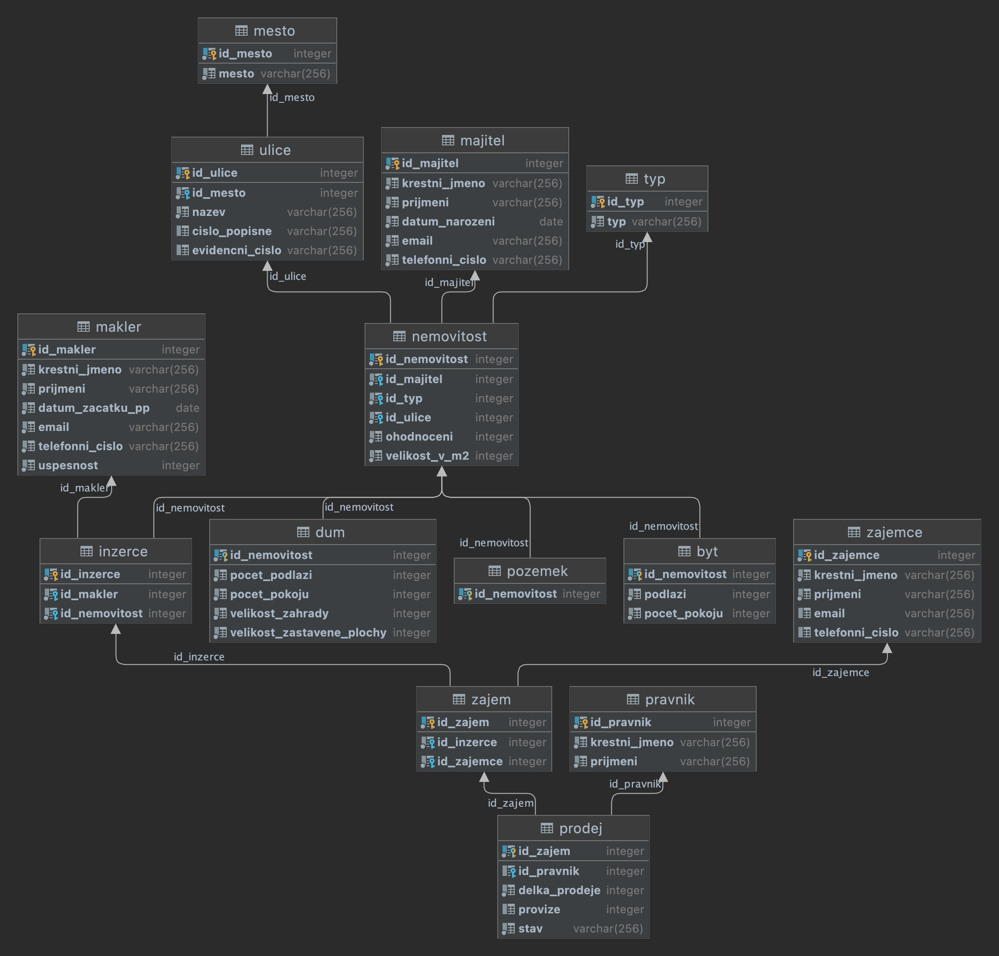

# Real Estate Agency database
- Final project for BI-DBS.21 course.
- Scored 53.5/50.
- Whole project was made in Czech.
- Consists of 25 SQL queries, 13 RA queries and over 900 inserts.

# Realitní kancelář

Databáze bude zaznamenávat ukončené i probíhající **inzerce** a  **prodeje** nemovitostí a rejstřík **makléřů**.

**Nemovitosti** se budou následně dělit na **domy**, **byty** a **pozemky**.

Provize z prodeje nemovitosti do 3 000 000 kč je 5 % z konečné ceny.

**Makléř** bude definovaný celým jménem, emailem, telefoním číslem, začátkem pracovního poměru, celkovou získanou provizí a procentuální úspěšností. Makléř navíc řeší inzerci, prohlídky nemovitostí a konečný prodej.

**Zájemce** bude označen nemovitostí, o kterou má zájem, kontaktnímy údaji (telefon, email) a svým jménem. Zájemce se následně může stát kupujícím dané nemovitosti tím, že projeví **zájem** o danou nemovitost.

U **prodeje** budou vždy známé minimálně 3 strany, majitel, kupující a makléř, stav prodeje (probíha, úspěch, neúspěch). Následně zde bude zaznamenáno, o jakou nemovitost se jedná, cena nemovitosti, provize realitní kanceláře a délka celkového obchodu. Na prodej může, ale nemusí dohlížet **právník**. Kancelář má svého právníka s id 1. Každý zákazník však může zažádat o prodej bez právníka nebo o právníka svého.

**Majitel** nemovitosti bude vždy popsán svým jménem a příjmením, kontaktními údaji (jak email, tak telefoní číslo) a datem narození. Každá nemovitost bude muset mít májitele pouze jednoho.

U **nemovitosti** bude znám, majitel,  **typ** (byt, dům, pozemek) a podtyp (les, louka...), velikost v m2, cena na m2, počet místností (1+kk, 2+1,...), počet pater, adresa (město, ulice, evidenční číslo nebo číslo popisné). U každého typu nemovitosti budou známy jiné atributy. Kancelář také umožňuje prodej netradičních nemovitostí, jako je maringotka, podkrovní byt nebo dokonce zámek.

## Schéma

 